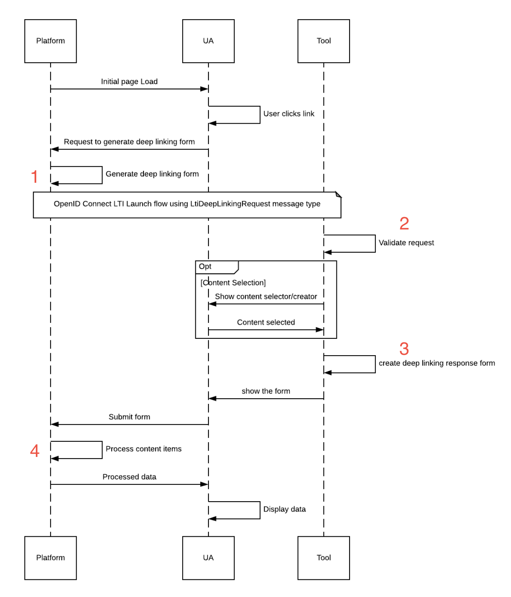

# Deep Linking Workflow

> How to [perform secured Deep Linking interactions](https://www.imsglobal.org/spec/lti-dl/v2p0/#workflow), between platforms and tools.

## Workflow

You can find below a Deep Linking workflow diagram, with steps numbers:



Each step will be detailed below, from both platform and tool perspectives.

## Table of contents

- [1 - Platform side: deep linking request generation](#1---platform-side-deep-linking-request-generation)
- [2 - Tool side: deep linking request handling](#2---tool-side-deep-linking-request-handling)
- [3 - Tool side: deep linking response generation](#3---tool-side-deep-linking-response-generation)
- [4 - Platform side: deep linking response handling](#4---platform-side-deep-linking-response-handling)

## 1 - Platform side: deep linking request generation

You can find below required steps to generate a deep linking request message, needed only if you're acting as a platform.

### Create the message

As a platform, you can create a [deep linking request message](https://www.imsglobal.org/spec/lti-dl/v2p0/#deep-linking-request-message) for a tool within the context of a registration.

Platforms can drive the tool behaviour on deep linking interactions by providing [deep linking settings](https://www.imsglobal.org/spec/lti-dl/v2p0/#deep-linking-settings).

You have to first provide a [DeepLinkingSettingsInterface](../src/Settings/DeepLinkingSettingsInterface.php) implementation to configure your settings:

```php
<?php

use OAT\Library\Lti1p3Core\Resource\Link\LinkInterface;
use OAT\Library\Lti1p3Core\Resource\LtiResourceLink\LtiResourceLinkInterface;
use OAT\Library\Lti1p3DeepLinking\Settings\DeepLinkingSettings;

// Create deep linking settings
$deepLinkingSettings = new DeepLinkingSettings(
    'http://platform.com/deep-linking-return',  // [required] platform url where to return content items
    [
        LinkInterface::TYPE,                    // [required] array of accepted content items types 
        LtiResourceLinkInterface::TYPE,
    ],
    [                                           // [required] array of accepted presentation document targets
        'window',
        'iframe'
    ],
    'image/*,text/html',                        // [optional] list of accepted media types, comma separated
    true,                                       // [optional] if should accept multiple content items (default true)
    false,                                      // [optional] if should auto create content items tool side (default false)
    'Title',                                    // [optional] title
    'Description'                               // [optional] description
);
```

Then, you can use the [DeepLinkingLaunchRequestBuilder](../src/Message/Launch/Builder/DeepLinkingLaunchRequestBuilder.php) to create the message:
```php
<?php

use OAT\Library\Lti1p3Core\Registration\RegistrationRepositoryInterface;
use OAT\Library\Lti1p3DeepLinking\Message\Launch\Builder\DeepLinkingLaunchRequestBuilder;

// Create a builder instance
$builder = new DeepLinkingLaunchRequestBuilder();

// Get related registration of the launch
/** @var RegistrationRepositoryInterface $registrationRepository */
$registration = $registrationRepository->find(...);

// Build a deep linking request launch message
$message = $builder->buildDeepLinkingLaunchRequest(
    $deepLinkingSettings,                                          // [required] deep linking settings
    $registration,                                                 // [required] related registration
    'loginHint',                                                   // [required] login hint that will be used afterwards by the platform to perform authentication
    'http://platform.com/deep-linking-return',                     // [optional] will launch to provided url, or fallback to tool's default deep linking url if null
    null,                                                          // [optional] will use the registration default deployment id, but you can pass a specific one
    ['http://purl.imsglobal.org/vocab/lis/v2/membership#Learner'], // [optional] roles
    ['myCustomClaim' => 'myCustomValue']                           // [optional] supplementary claims if needed
);
```

### Launch the message

As a result of the build, you get a [LtiMessageInterface](../../src/Message/LtiMessageInterface.php) instance that has to be used in the following ways:

```php
<?php

use OAT\Library\Lti1p3Core\Message\LtiMessageInterface;

/** @var LtiMessageInterface $message */

// Main message properties you can use as you want to offer the launch to the platform users
echo $message->getUrl();                // url of the launch
echo $message->getParameters()->all();  // array of parameters of the launch

// Or use those helpers methods to ease the launch interactions
echo $message->toUrl();                // url with launch parameters as query parameters
echo $message->toHtmlLink('click me'); // HTML link, where href is the output url
echo $message->toHtmlRedirectForm();   // HTML hidden form, with possibility of auto redirection
```

### Implement OpenId Connect launch flow

Like any platform originating message, when the deep linking request message is launched, an [OIDC flow](https://www.imsglobal.org/spec/security/v1p0/#platform-originating-messages) will start between the tool and the platform.

The underlying core library offers everything you need to securely implement this flow, as documented in the [platform originating messages documentation](https://github.com/oat-sa/lib-lti1p3-core/blob/master/doc/message/platform-originating-messages.md).

## 2 - Tool side: deep linking request handling

You can find below required steps to handle a deep linking launch request, needed only if you're acting as a tool.

### Validate the request 

As a tool, you'll receive an HTTP request containing the [Deep Linking request message](https://www.imsglobal.org/spec/lti-dl/v2p0/#deep-linking-request-message), generated by the platform, received after OIDC flow completion.

You can use the [ToolLaunchValidator](https://github.com/oat-sa/lib-lti1p3-core/blob/master/src/Message/Launch/Validator/ToolLaunchValidator.php) to validate it:

```php
<?php

use OAT\Library\Lti1p3Core\Message\Launch\Validator\Tool\ToolLaunchValidator;
use OAT\Library\Lti1p3Core\Registration\RegistrationRepositoryInterface;
use OAT\Library\Lti1p3Core\Security\Nonce\NonceRepositoryInterface;
use Psr\Http\Message\ServerRequestInterface;

/** @var RegistrationRepositoryInterface $registrationRepository */
$registrationRepository = ...

/** @var NonceRepositoryInterface $nonceRepository */
$nonceRepository = ...

/** @var ServerRequestInterface $request */
$request = ...

// Create the validator
$validator = new ToolLaunchValidator($registrationRepository, $nonceRepository);

// Perform validation
$result = $validator->validatePlatformOriginatingLaunch($request);

if (!$result->hasError()) {
    // Your logic to handle the deep linking request and offer content items selection
}
```
**Note**: more details about platform originating messages on tool side validation can be found in the [platform originating messages documentation](https://github.com/oat-sa/lib-lti1p3-core/blob/master/doc/message/platform-originating-messages.md#4---tool-side-launch-validation).

### Offer content items selection

When a deep linking request is received by a tool, the tool may offer the user [content items](https://www.imsglobal.org/spec/lti-dl/v2p0/#content-item-types) selection according to the platform deep linking settings.

For example:

```php
<?php

use OAT\Library\Lti1p3Core\Message\Launch\Validator\Result\LaunchValidationResultInterface;

/** @var LaunchValidationResultInterface $result */
$result = $validator->validatePlatformOriginatingLaunch($request);

if (!$result->hasError()) {
    // You have access to platform deep linking settings claim
    $settings = $result->getPayload()->getDeepLinkingSettings();

    // You can extract from it the information to build and offer relevant content items selection 
    var_dump($settings->getDeepLinkingReturnUrl());                // 'http://platform.com/deep-linking-return'
    var_dump($settings->getAcceptedTypes());                       // ['link', 'ltiResourceLink']
    var_dump($settings->getAcceptedPresentationDocumentTargets()); // ['window', 'iframe']
    ...
} 
```

From here, up to you to decide if / how you offer content items selection: you can offer the user an `HTML Form` for example.

Since this process can differ a lot between tool applications, this library **does not provide any tooling for this** (to leave you free to provide your own process). 

The library will take care of the rest of the process, when the tool will return the selected content items to the platform.

## 3 - Tool side: deep linking response generation

You can find below required steps to provide a deep linking response to return the content items selection, needed only if you're acting as a tool.

### Collect the content items to be returned

Depending on if / how you offered content items selection tool side, you can afterwards aggregate selected resources in a [ResourceCollectionInterface](https://github.com/oat-sa/lib-lti1p3-core/blob/master/src/Resource/ResourceCollectionInterface.php) implementation:

```php
<?php

use OAT\Library\Lti1p3Core\Resource\Link\Link;
use OAT\Library\Lti1p3Core\Resource\LtiResourceLink\LtiResourceLink;
use OAT\Library\Lti1p3Core\Resource\ResourceCollection;

// Get selected content items (resources)
$link = new Link('linkIdentifier', 'http://tool.com/some-link');
$ltiResourceLink = new LtiResourceLink('ltiResourceLinkIdentifier', ['url' => 'http://tool.com/launch']);

// Aggregate them in a collection
$resourceCollection = new ResourceCollection();
$resourceCollection
    ->add($link)
    ->add($ltiResourceLink);
```

### Create the message

Once the resource collection ready, you can return it to the platform in a [deep linking response message](https://www.imsglobal.org/spec/lti-dl/v2p0/#deep-linking-response-message), by using the [DeepLinkingLaunchResponseBuilder](../src/Message/Launch/Builder/DeepLinkingLaunchResponseBuilder.php):

```php
<?php

use OAT\Library\Lti1p3Core\Message\Launch\Validator\Result\LaunchValidationResultInterface;
use OAT\Library\Lti1p3Core\Registration\RegistrationRepositoryInterface;
use OAT\Library\Lti1p3DeepLinking\Message\Launch\Builder\DeepLinkingLaunchResponseBuilder;

/** @var LaunchValidationResultInterface $result */
$result = $validator->validatePlatformOriginatingLaunch(...);

// Create a builder instance
$builder = new DeepLinkingLaunchResponseBuilder();

// Related deep linking platform settings claim from previous steps
$deepLinkingSettingsClaim = $result->getPayload()->getDeepLinkingSettings();

// Get related registration of the launch
/** @var RegistrationRepositoryInterface $registrationRepository */
$registration = $registrationRepository->find(...);

// Build a deep linking response launch message
$message = $builder->buildDeepLinkingLaunchResponse(
    $resourceCollection,                                   // [required] content items collection
    $registration,                                         // [required] related registration
    $deepLinkingSettingsClaim->getDeepLinkingReturnUrl(),  // [required] platform url whereto return content items
    null,                                                  // [optional] will use the registration default deployment id, but you can pass a specific one
    $deepLinkingSettingsClaim->getData(),                  // [optional] platform settings data, must be returned unaltered if provided
    '2 content items provided with success'                // [optional] to override the default feedback message
);
```

### Launch the message

As a result of the build, you get a [LtiMessageInterface](../../src/Message/LtiMessageInterface.php) instance that [has to be sent as a form POST](https://www.imsglobal.org/spec/lti-dl/v2p0/#deep-linking-response-message):

```php
<?php

use OAT\Library\Lti1p3Core\Message\LtiMessageInterface;

/** @var LtiMessageInterface $message */
echo $message->toHtmlRedirectForm(); // HTML form containing the auto generated JWT parameter
```

## 4 - Platform side: deep linking response handling

You can find below required steps to validate a deep linking response, needed only if you're acting as a platform.

### Validate the response

As a platform, you'll receive an HTTP request containing the deep linking response message.

The [PlatformLaunchValidator](https://github.com/oat-sa/lib-lti1p3-core/blob/master/src/Message/Launch/Validator/PlatformLaunchValidator.php) can be used for this:

- it requires a registration repository and a nonce repository implementations [as explained here](https://github.com/oat-sa/lib-lti1p3-core/blob/master/doc/quickstart/interfaces.md)
- it expects a [PSR7 ServerRequestInterface](https://www.php-fig.org/psr/psr-7/#321-psrhttpmessageserverrequestinterface) to validate
- it will output a [LaunchValidationResult](https://github.com/oat-sa/lib-lti1p3-core/blob/master/src/Message/Launch/Validator/Result/LaunchValidationResult.php) representing the launch validation, the related registration and the deep linking response payload itself.

```php
<?php

use OAT\Library\Lti1p3Core\Message\Launch\Validator\Platform\PlatformLaunchValidator;
use OAT\Library\Lti1p3Core\Registration\RegistrationRepositoryInterface;
use OAT\Library\Lti1p3Core\Security\Nonce\NonceRepositoryInterface;
use Psr\Http\Message\ServerRequestInterface;

/** @var RegistrationRepositoryInterface $registrationRepository */
$registrationRepository = ...

/** @var NonceRepositoryInterface $nonceRepository */
$nonceRepository = ...

/** @var ServerRequestInterface $request */
$request = ...

// Create the validator
$validator = new PlatformLaunchValidator($registrationRepository, $nonceRepository);

// Perform validation
$result = $validator->validateToolOriginatingLaunch($request);

if (!$result->hasError()) {
    // Your logic to handle the returned content items
}
```
**Note**: more details about tool originating messages on platform side validation can be found in the [tool originating messages documentation](https://github.com/oat-sa/lib-lti1p3-core/blob/master/doc/message/tool-originating-messages.md#2---platform-side-launch-validation).

### Handle the returned content items

Once the deep linking response validation done, you can access the [returned content items](https://www.imsglobal.org/spec/lti-dl/v2p0/#content-items) from the response payload:

```php
<?php

use OAT\Library\Lti1p3Core\Message\Launch\Validator\Result\LaunchValidationResultInterface;
use OAT\Library\Lti1p3Core\Resource\Link\LinkInterface;
use OAT\Library\Lti1p3Core\Resource\LtiResourceLink\LtiResourceLinkInterface;
use OAT\Library\Lti1p3DeepLinking\Factory\ResourceCollectionFactory;

/** @var LaunchValidationResultInterface $result */
$result = $validator->validateToolOriginatingLaunch($request);

if (!$result->hasError()) {
    // You have access to tool deep linking content items claim
    $contentItems = $result->getPayload()->getDeepLinkingContentItems();

    // You can use the ResourceCollectionFactory to ease the resources extraction as collection
    $returnedResourceCollection = (new ResourceCollectionFactory())->createFromClaim($contentItems);

    // Then perform your resources manipulations, for example:
    $returnedLink = current($returnedResourceCollection->getByType(LinkInterface::TYPE));
    echo $returnedLink->getIdentifier(); // 'linkIdentifier'
    echo $returnedLink->getUrl();        // 'http://tool.com/some-link'

    $returnedLtiResourceLinkLink = current($returnedResourceCollection->getByType(LtiResourceLinkInterface::TYPE));
    echo $returnedLtiResourceLinkLink->getIdentifier(); // 'ltiResourceLinkIdentifier'
    echo $returnedLtiResourceLinkLink->getUrl();        // 'http://tool.com/launch'
    ...
} 
```

**Note**: if an [LtiResourceLink](https://www.imsglobal.org/spec/lti-dl/v2p0/#lti-resource-link) instance is returned, you can easily create a launch from it by following the [platform originating messages documentation](https://github.com/oat-sa/lib-lti1p3-core/blob/master/doc/message/platform-originating-messages.md#launching-an-lti-resource-link).
